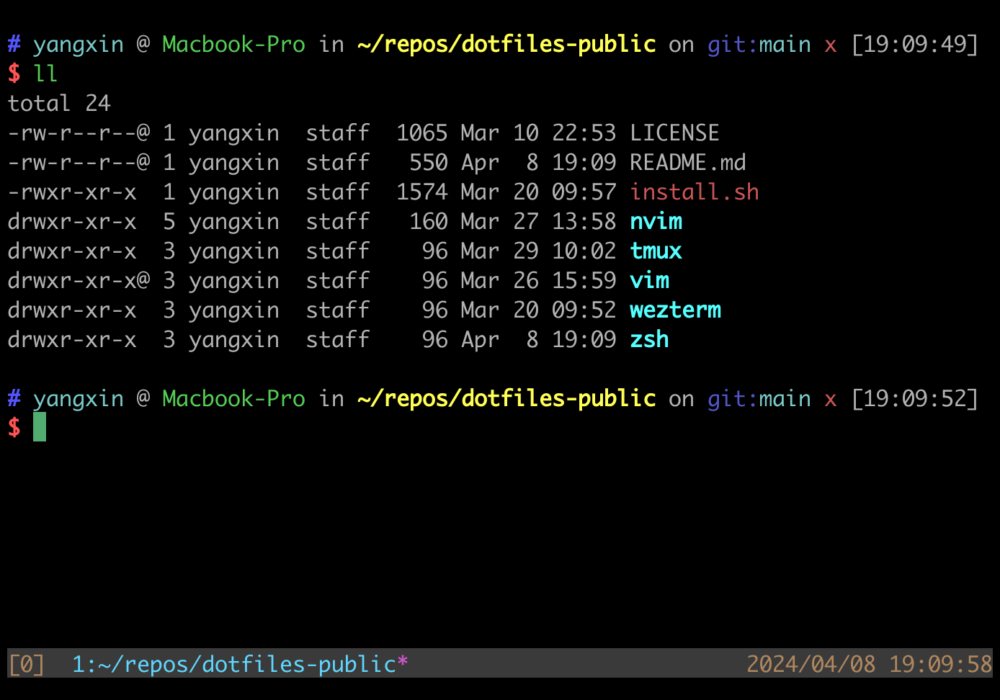

# yangx1n0's Dotfiles

### Contents

- neovim config
- vim config
- zsh config (requires fzf and oh-my-zsh)
- tmux config
- wezterm config

### Neovim setup

- Neovim >= **0.9.0**
- Git >= **2.19.0** (partial clones support)
- **C** compiler for nvim-treesitter

### Shell setup

- zsh shell
- oh-my-zsh
- fzf

### Tmux setup

- tmux >= 3.0

```
export DOTFILES=/path/to/dotfiles-public
ln -s $DOTFILES/nvim $HOME/.config/nvim
ln -s $DOTFILES/tmux $HOME/.config/tmux
ln -s $DOTFILES/wezterm $HOME/.config/wezterm
echo 'source /path/to/dotfiles-public/zsh/config.zsh' >> $HOME/.zshrc
```

### Screenshot




